


 

<h3>📣 Share the roadmap</h3>

 

Are you ready to embark on an electrifying journey into the depths of cybersecurity? Whether you're eyeing a prestigious certification, gearing up for a Bachelor's degree, or simply indulging your insatiable curiosity, this roadmap is your ultimate guide to becoming a true hacking virtuoso. But before we dive into the nitty-gritty, let's set the stage. Are you in it for the thrill, the challenge, or perhaps envisioning a career at the cutting edge of cyber defense? Your motivations will shape the path ahead, so let's chart a course tailored precisely to your aspirations.

## 🧭 Choose Your Path

  <a href="#Hobbyist-Hackers"></a>
  <a href="#Cyber-Expressway"></a>
  <a href="#Bug-Bounty-Hunter"></a>
   
  <a href="#Certification-Seekers"></a>
  <a href="#Degree-Pursuers"></a>

 

| | Roadmap Type | Path Information | Pace |
| :-: | ------------ | ---------------- | :--: |
| 🟢 | [**Hobbyist Hackers**](#Hobbyist-Hackers) | Ideal for dipping your toe into the cybersecurity world, mastering basics and honing skills | Self-paced |
| 🔵 | [**Cyber Expressway**](#Cyber-Expressway) | Begin your cybersecurity journey as quickly as possible, join a cybersecurity role in under 10 months | ~10 months |
| 🟠 | [**Bug Bounty Hunter**](#Bug-Bounty-Hunter) | Discover the steps to become a bug bounty hunter and secure your first bounty | Ongoing |
| 🟣 | [**Certification Seekers**](#Certification-Seekers) | Gain knowledge, invest time for deeper understanding, ideal for advancement in cybersecurity | Cert by cert |
| 🩷 | [**Degree Pursuers**](#Degree-Pursuers) | Refine skills for optimal cybersecurity training, explore paths & more ➜ **gain a cybersecurity degree** | ~1 WGU term |

> [!NOTE]
> While I offer this content for free, I include some referral links. They let you support the project without any downside for you. Enjoy the content and feel free to [share it](#share) with your friends! ⭐ Starring the repo also helps others find it.

## 🧰 Access My Additional Hacking Resources

🌐 **[hacking-notes.com](https://hacking-notes.com)**

| | Resource | What you get |
| :-: | -------- | ------------ |
| 🔴 | **[RedTeam Notes](https://github.com/Hacking-Notes/Redteam)** | My Red Team hacking notes, your go-to resource for offensive security with steadfast determination and state-of-the-art strategies. |
| 🔷 | **[BlueTeam Notes](https://github.com/Hacking-Notes/Blueteam)** | My Blue Team hacking notes, your go-to resource for defending against cyber threats with steadfast determination and state-of-the-art strategies. |
| 🧩 | **[Chrome Extension](https://github.com/Hacking-Notes/Extensions)** | Enhance your hacking toolkit. Designed for ethical hacking and red team activities, with tailored features for an improved browsing experience. |
| 🔖 | **[Bookmarks](https://github.com/Hacking-Notes/Bookmarks)** | Elevate your bookmarking game with my Bookmark Toolkit, engineered for ethical web exploration with customized features for a seamless browsing journey. |

## 🟢 Roadmap for Hobbyist Hackers


Are you someone who's delving into the realm of hacking as a hobby, eager to explore and gain expertise for the sheer thrill of it? If so, then the journey from being a mere novice, often referred to as a "script kiddie," to evolving into a proficient hacker can be facilitated by following the steps outlined below. These steps will direct you towards the necessary resources and knowledge that will help you hone your skills and transform you into a knowledgeable practitioner in the field of hacking.


### `01` Learn the Basics on [TryHackMe](https://tryhackme.com/signup?referrer=630a8d48aa25650060a8f62d)
- **🎯 Objective:** Build a foundational understanding of hacking concepts and techniques in a guided environment.
- **✅ Actions:**
  - [ ] Sign up for a [TryHackMe account](https://tryhackme.com/signup?referrer=630a8d48aa25650060a8f62d).
  - Complete introductory rooms and pathways to learn about topics such as:
    - [ ] [The complete beginner path](https://tryhackme.com/path/outline/beginner?referrer=630a8d48aa25650060a8f62d)
    - [ ] [Introduction to Cyber Security](https://tryhackme.com/path/outline/introtocyber?referrer=630a8d48aa25650060a8f62d)
    - [ ] [Web Fundamentals](https://tryhackme.com/path/outline/web?referrer=630a8d48aa25650060a8f62d)
    - [ ] [Red Teaming](https://tryhackme.com/path/outline/redteaming?referrer=630a8d48aa25650060a8f62d)
    - [ ] [Jr Penetration Tester](https://tryhackme.com/path/outline/jrpenetrationtester?referrer=630a8d48aa25650060a8f62d)
- **💡 Explanation:** TryHackMe offers beginner-friendly content that covers essential topics, making it an ideal starting point for those new to hacking.

### `02` Enroll in [PortSwigger Academy](https://portswigger.net/web-security/dashboard)
- **🎯 Objective:** Deepen your understanding of web pentesting techniques and tools.
- **✅ Actions:**
  - [ ] Explore the courses available on Burp Suite Academy.
  - [ ] Complete courses covering topics such as:
    - [ ] Web application security fundamentals
    - [ ] Using Burp Suite for web pentesting
    - [ ] Advanced web exploitation techniques
- **💡 Explanation:** Burp Suite Academy offers comprehensive courses specifically focused on web pentesting, including both theoretical knowledge and practical exercises. This will enhance your ability to identify and exploit vulnerabilities in web applications.

### `03` Practice Hands-On Challenges on Hack The Box (More Advanced)
- **🎯 Objective:** Gain practical experience by solving real-world hacking challenges in an unguided environment.
- **✅ Actions:**
  - [ ] Register on [Hack The Box platform](https://app.hackthebox.com/invite).
  - [ ] Attempt beginner-friendly machines to apply the knowledge gained from TryHackMe.
  - [ ] Progress to more challenging machines as skills improve.
- **💡 Explanation:** Hack The Box provides a platform for honing your skills through hands-on experience with realistic scenarios. Unlike TryHackMe, it doesn't offer guided pathways, which encourages independent problem-solving and critical thinking.

### `04` Continuously Expand Knowledge and Skills
- **🎯 Objective:** Stay updated with the latest trends, techniques, and tools in the field of hacking.
- **✅ Actions:**
  - Participate in online forums and communities (e.g., Reddit's r/hacking, Hack Forums) to engage with other hackers and learn from their experiences.
  - Follow security blogs, podcasts, and YouTube channels to keep abreast of new developments and insights.
  - Regularly challenge yourself with new hacking tasks, puzzles, and CTF (Capture The Flag) competitions.
- **💡 Explanation:** Hacking is a dynamic field, and continuous learning is essential to stay relevant and proficient. By actively engaging with the hacking community and exploring new challenges, you'll continue to refine your skills and expand your knowledge base.

### `05` CTF / Bug Bounty

**🚩 Capture The Flag (CTF) Competitions:**
- Join online CTF platforms such as Hack The Box, OverTheWire, or picoCTF.
- Participate in both beginner and advanced CTF challenges to apply your knowledge and problem-solving skills.
- Collaborate with other participants or teams to tackle more complex challenges and learn from each other's approaches.
- Analyze the solutions and write-ups of challenges you couldn't solve to understand different techniques and strategies.

**🐞 Bug Bounty Programs:**
- [ ] Register on bug bounty platforms like HackerOne, Bugcrowd, or Synack.
- Browse available programs and identify those aligned with your expertise and interests, such as web application testing, mobile application testing, or network penetration testing.
- Ethically report security vulnerabilities you discover in the targets specified by bug bounty programs.
- Follow the guidelines provided by each program regarding vulnerability disclosure, severity assessment, and reward eligibility.
- Continuously monitor the platforms for new programs and updates, as well as feedback on your submissions.

<a href="#top">⬆ back to top</a>

## 🔵 Roadmap for Cyber Expressway


Are you seeking to quickly establish yourself in the world of Cybersecurity/Pentesting? I've crafted a rapid roadmap, inspired by Tyler Ramsbey, to guide you toward a job in this field within the next 10 months. Keep in mind, while there are no guarantees, these steps offer the best available information to position you at the forefront of pentesting roles.

> [!TIP]
> ▶️ Access identical information through an interactive video: [Tyler Ramsbey - YouTube](https://www.youtube.com/watch?v=IWx88uvfKbA)

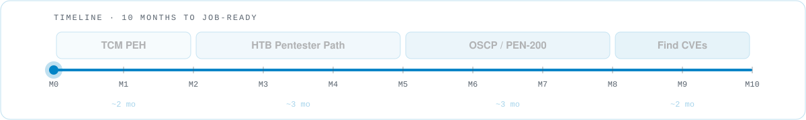

### `01` TCM Security · Practical Ethical Hacker course ⏱ about 2 months
- [ ] Join TCM Security by completing the registration process.
- [ ] Obtain access through a subscription plan.
- Complete the following courses
  - [ ] [Practical Ethical Hacking](https://academy.tcm-sec.com/p/practical-ethical-hacking-the-complete-course)
  - [ ] [Practical Web Hacking](https://academy.tcm-sec.com/p/practical-web-hacking) **(OPTIONAL)**

### `02` Hack The Box · Pentest pathway ⏱ about 2-3 months
- [ ] Sign up via [Hack The Box Academy](https://referral.hackthebox.com/mz8mcbX) platform.
- [ ] Acquire credits for course enrollment and procure a voucher.
- Complete the following courses
  - [ ] [Penetration Tester](https://academy.hackthebox.com/paths/jobrole)

### `03` OSCP · PEN-200: Penetration Testing with Kali Linux ⏱ about 3 months
This certification serves as a gold standard in cybersecurity and often bypasses many HR screening processes.
- [ ] Enroll in the Offensive Security website for the [PEN-200 course](https://www.offsec.com/courses/pen-200/).
- [ ] Purchase the 90-day lab access package.
- [ ] Study course materials and Kali Linux documentation.
- [ ] Practice in the lab environment, exploiting vulnerabilities.
- [ ] Prepare for the exam with thorough review and practice.
- [ ] Schedule and take the exam.
- [ ] Successfully complete the exam.

### `04` Search and Find CVEs
Uncovering vulnerabilities within diverse open-source projects is a rewarding endeavor, and it's not as daunting as one might expect. Including CVE discoveries in your resume distinguishes you from peers with similar certifications, demonstrating to future employers your ability to apply learned skills effectively.
- [ ] View the following video [Tyler Ramsbey - YouTube](https://www.youtube.com/watch?v=2VB4Zd5C8N8)

> [!IMPORTANT]
> **Additional perk:** Receive assistance with your resume and engage in a conversation with an ethical hacker at no cost, or contribute as you wish and donate to a charity of your choosing. Just join the [Discord server](https://discord.gg/r68ameNHrD) and arrange your appointment.

<a href="#top">⬆ back to top</a>

## 🟠 Roadmap for Bug Bounty Hunter


Bug bounty hunting is a constantly evolving field where participants are continuously learning and adapting as they progress. There isn't a specific milestone or achievement that indicates you're ready to start finding bugs, which can make it challenging for newcomers to navigate, especially without a clear path to follow.

This roadmap is designed to help you build a strong foundation in bug bounty hunting and gradually move on to more profitable programs with higher payouts.

### `01` The Mindset of a Bug Bounty Hunter and Continuous Learning

Before diving into the technical aspects, it's essential to adopt the right mindset. Bug bounty hunting requires perseverance, creativity, and a never-give-up attitude. The "hacker mindset" is all about approaching problems with curiosity and determination. You'll face many challenges and failures, but each setback is an opportunity to learn and improve.

**Understanding Code and Learning Continuously**

Understanding how code works is crucial, though you don't necessarily need to be an expert coder. What's more important is knowing how to analyze and manipulate code to find vulnerabilities. While learning to code can enhance your ability to understand and exploit vulnerabilities effectively, the focus should be on understanding the application's behavior and how to identify potential weaknesses.

Bug bounty hunting is a field with no fixed endpoint of knowledge. New vulnerabilities and techniques are constantly emerging, so continuous learning is vital. Commit to exploring new research, following experts, and engaging with the community to stay updated. Join forums, [discords](https://discord.gg/bugbounty), watch YouTube channels, and participate in discussions to enhance your skills and knowledge regularly.

### `02` Building a Strong Foundation

If you're new to IT, start by building a solid foundation in basic IT and web application concepts. This will make your journey much smoother. Understanding web technologies, how websites are structured, and how data flows between clients and servers is crucial. Familiarize yourself with HTML, JavaScript, HTTP, and other core web technologies.

**Basic Knowledge You Should Acquire:**
- **🌐 Networking:** Understanding TCP/IP, DNS, and HTTP protocols.
- **🧱 Web Technologies:** Basics of HTML, JavaScript, CSS, and server-side languages.
- **⚠️ Common Vulnerabilities:** Familiarize yourself with the OWASP Top Ten, which covers the most critical security risks to web applications.

> [!TIP]
> You can acquire this knowledge for free on TryHackMe. (Skip this if you already have the foundational skills mentioned.)

**Step 1:** Register on [TryHackMe](https://tryhackme.com/)
- **🎯 Objective:** Get the initial IT and web app knowledge
- **✅ Actions:** Complete the following courses
  - [ ] [Complete Beginner](https://tryhackme.com/path/outline/beginner)
  - [ ] [Web Fundamentals](https://tryhackme.com/path/outline/web)
  - Feel free to explore additional topics if you wish.

### `03` Selecting and Exploring a Bug Bounty Program

Choosing the right bug bounty program is crucial for your success. Instead of diving into high-profile programs like Facebook or Google right away, it's best to start with platforms that have a lower barrier to entry, such as OpenBugBounty. These platforms are less competitive and provide a better learning environment for beginners.

When selecting a program, look for one that interests you and has a broad scope, including multiple URLs and functionalities like login features, purchasing options, or search capabilities. A well-chosen program will offer plenty of opportunities for exploration and learning.

It's also important to thoroughly read and understand the program's policies before you begin. Knowing the rules will help you stay within legal boundaries and focus your efforts on areas that are most likely to yield results.

**Step 1:** Register on [OpenBugBounty](https://www.openbugbounty.org/)
- **🎯 Objective:** Research a program that you find interesting and has a decent scope (multiple URLs and functionalities)
- **✅ Actions:**
  - [ ] Explore the available programs inside OpenBugBounty.
  - [ ] Select a program.

**Step 2:** Enroll in [PortSwigger Academy](https://portswigger.net/web-security/dashboard)
- **🎯 Objective:** Enhance your web pentesting skills.
- **✅ Actions:**
  - [ ] Explore the courses available on Burp Suite Academy.
  - [ ] Explore the following [paths](https://portswigger.net/web-security/all-topics) and start with what seems to you the most interesting:
    - [ ] Server-side vulnerabilities
    - [ ] Cross-site scripting (XSS)
    - [ ] File upload vulnerabilities
    - [ ] Clickjacking (UI redressing)
    - [ ] Path traversal
    - [ ] Server-side request forgery (SSRF)
    - [ ] Cross-site request forgery (CSRF)
    - [ ] Cross-origin resource sharing (CORS)
    - [ ] API testing
    - [ ] Web cache deception
    - [ ] SQL injection
    - [ ] NoSQL injection
    - [ ] Authentication vulnerabilities
    - [ ] WebSockets vulnerabilities
    - ...
  - Apply what you learn directly to your selected program.

### `04` Phases of Bug Bounty Hunting


Bug bounty hunting involves several key phases, each requiring a different skill set:

| Phase | What it involves |
| ----- | ---------------- |
| 🔭 **Reconnaissance** | Gathering information about your target. This phase involves mapping out the attack surface and identifying potential entry points. |
| 📡 **Scanning** | Using tools to automate the process of finding vulnerabilities. Tools like Nmap, Burp Suite, and others can help you identify weaknesses in the target application. |
| 💥 **Exploitation** | Once a vulnerability is found, the next step is to exploit it to understand its impact fully. This phase requires creativity and a deep understanding of the underlying technologies. |
| 📝 **Reporting** | Documenting your findings and submitting a clear, concise report. A well-written report can make the difference between a successful submission and one that is rejected or deemed low priority. |

### `05` Starting Small and Progressing

**Starting with the Easiest Bugs**

As a beginner, focus on finding the easiest bugs first. These are typically low-hanging fruit that are more common and easier to identify. Here are a few examples:

- **Cross-Site Scripting (XSS):** Injecting malicious scripts into web pages viewed by others.
- **Security Misconfigurations:** Issues like unnecessary services being enabled or default accounts being left active.
- **Insecure Direct Object References (IDOR):** Accessing unauthorized data by manipulating the input in the URL.

Starting with these easier bugs helps build confidence and hone your skills for tackling more complex vulnerabilities later on.

**Progression Roadmap**

Progression in bug bounty hunting should be gradual and deliberate. Here's a suggested roadmap:

1. **Start Small:** Begin with simple vulnerabilities and smaller programs. Focus on platforms with less competition, like OpenBugBounty.
2. **Build Your Skills:** Use resources like PortSwigger Academy to deepen your understanding of web security.
3. **Increase Complexity:** As you gain experience, tackle more complex vulnerabilities and move to larger, more lucrative programs.
4. **Stay Updated:** Constantly learn and adapt to new security trends and techniques.
5. **Collaborate:** Partner with other hunters to expand your skill set and discover more bugs.

### `06` The Importance of Collaboration

Collaborating with others in the bug bounty community can significantly boost your progress. Working with more experienced hunters allows you to learn new techniques, share tools, and even co-author reports. The collective knowledge of a team can uncover bugs that you might have missed working alone.

Joining forums, participating in Capture the Flag (CTF) competitions, and engaging in community events are great ways to meet other hunters and start collaborating.

### `07` Time Management and Setting Realistic Expectations

Effective time management is crucial in bug bounty hunting. The pursuit of finding vulnerabilities can be time-consuming and challenging, so it's essential to set realistic goals and manage your time wisely. Here are some tips to help you stay on track:

- **Set Clear Goals:** Define specific objectives for each session, such as identifying a certain number of potential vulnerabilities or completing a particular phase of the reconnaissance.
- **Establish Time Limits:** Allocate specific time blocks for tasks and stick to them. This helps prevent burnout and keeps you focused on the most critical aspects of your work.
- **Track Your Progress:** Regularly review what you've accomplished and adjust your goals as needed. Keeping a record of your efforts helps maintain motivation and provides insights into your progress.

**Setting Realistic Expectations**

It's important to understand that finding your first bug can take time, often weeks or even months. Persistence and patience are key. Here's how to manage your expectations effectively:

- **Accept the Learning Curve:** Understand that bug bounty hunting involves a significant learning curve. Each challenge you encounter is an opportunity to improve your skills and knowledge.
- **Celebrate Small Victories:** Recognize and celebrate even minor successes. Each small find or lesson learned contributes to your overall growth as a bug bounty hunter.
- **Be Prepared for Setbacks:** Not every attempt will result in a bug or reward. View setbacks as part of the learning process and a chance to refine your approach.

By combining effective time management with realistic expectations, you'll be better equipped to handle the ups and downs of bug bounty hunting, stay motivated, and continue making progress.

<a href="#top">⬆ back to top</a>

## 🟣 Roadmap for Certification Seekers


Certifications in cybersecurity and hacking provide structured learning paths and validate skills, ranging from foundational IT knowledge to advanced penetration testing and defensive strategies. They offer credibility within the industry and demonstrate practical expertise, enhancing job opportunities and earning potential. However, they should be complemented by practical experience and continuous learning to stay updated in this rapidly evolving field.


###  &nbsp;`01` Start with Basic IT Skills (A+)

**CompTIA A+ Certification:** This certification covers foundational IT skills, including hardware, software, networking, and troubleshooting.
- [ ] Purchase CompTIA A+ voucher (2X, core 1 & core 2) ➜ [Discount Website](https://getcertified4less.com/search.php?search_query=a%2B)
- [ ] Study for CompTIA A+ Core 1
  - 📚 Studying: [Professor Messer](https://www.professormesser.com/free-a-plus-training/220-1101/220-1101-video/220-1101-training-course/)
- [ ] Successfully complete the exam (A+ Core 1)
- [ ] Study for CompTIA A+ Core 2
  - 📚 Studying: [Professor Messer](https://www.professormesser.com/free-a-plus-training/220-1102/220-1102-video/220-1102-training-course/)
- [ ] Successfully complete the exam (A+ Core 2)

###  &nbsp;`02` Linux Fundamentals (Linux Essentials)

**Linux Essentials (LPI):** Gain essential knowledge of Linux operating system fundamentals, commands, and basic administration.
- [ ] Purchase LPI Linux Essentials voucher ➜ [LPI Linux Essentials Website](https://us.lpimarketplace.com/shop/linux-essentials)
- [ ] Study for LPI Linux Essentials
  - 📚 Studying: [Shawn Powers](https://www.youtube.com/watch?v=skTShEHyXfo&list=PL78ppT-_wOmvlYSfyiLvkrsZTdQJ7A24L)
- [ ] Successfully complete the exam

###  &nbsp;`03` Build Networking Knowledge (Network+)

**CompTIA Network+ Certification:** Focuses on networking concepts, infrastructure, operations, and security.
- [ ] Purchase CompTIA Network+ voucher ➜ [Discount Website](https://getcertified4less.com/search.php?search_query=network%2B)
- [ ] Study for CompTIA Network+
  - 📚 Studying: [Professor Messer](https://www.professormesser.com/network-plus/n10-008/n10-008-video/n10-008-training-course/)
- [ ] Successfully complete the exam

###  &nbsp;`04` Learn Cybersecurity Fundamentals (Security+)

**CompTIA Security+ Certification:** Provides essential knowledge in network security, compliance, threats, and vulnerabilities.
- [ ] Purchase CompTIA Security+ voucher ➜ [Discount Website](https://getcertified4less.com/search.php?search_query=security%2B)
- [ ] Study for CompTIA Security+
  - 📚 Studying: [Professor Messer](https://www.professormesser.com/security-plus/sy0-701/sy0-701-video/sy0-701-comptia-security-plus-course/)
- [ ] Successfully complete the exam

###  &nbsp;`05` Specialize in Penetration Testing (PenTest+)

**CompTIA PenTest+ Certification:** Focuses on penetration testing and vulnerability assessment skills, essential for offensive security roles.
- [ ] Purchase CompTIA PenTest+ voucher ➜ [Discount Website](https://getcertified4less.com/search.php?search_query=pentest%2B)
- [ ] Study for CompTIA PenTest+
  - 📚 Studying: [ACI Learning](https://www.acilearning.com/products/itpro/)
- [ ] Successfully complete the exam

###  &nbsp;`06` Enhance Cyber Defense Skills (CySA+)

**CompTIA Cybersecurity Analyst (CySA+) Certification:** Develop skills in threat detection, analysis, and response.
- [ ] Purchase CompTIA CySA+ voucher ➜ [Discount Website](https://getcertified4less.com/search.php?search_query=cysa%2B)
- [ ] Study for CompTIA CySA+
  - 📚 Studying: [Certify Breakfast (YouTube)](https://www.youtube.com/watch?v=IGihuL5clDs&list=PLMYSjEaGLw_vGxGsAIUgmkbEm52QR02tx)
  - 📝 Exam practice: [Google Play (Phone)](https://play.google.com/store/apps/details?id=com.sima.comptiacysa&hl=en&gl=US)
- [ ] Successfully complete the exam

### 🏆 &nbsp;`07` Hands-On Practical Experience (OSCP)

Consider the **Offensive Security Certified Professional (OSCP)**: While not a traditional certification, OSCP provides practical penetration testing skills through real-world challenges and labs. See the [Cyber Expressway](#Cyber-Expressway) for the full OSCP checklist.

<a href="#top">⬆ back to top</a>

## 🩷 Roadmap for Degree Pursuers


There are numerous strategies available for the degree path, and the one outlined below represents my personal roadmap. It's important to consider that the most efficient strategy for achieving the degree with minimal cost involves completing the majority of the coursework outside of WGU, obtaining credits from those courses, and then enrolling when you're between 50-65% done, allowing you to finish the degree within one term. This approach minimizes expenses and is the optimal choice in terms of both time and money.


### 🎓 Bachelor of Science, Cybersecurity and Information Assurance (BSCSIA)
- [ ] Copy the following tracking [Google Sheet](https://docs.google.com/spreadsheets/d/11ohkoSAzkURpy3IcWtuVgH7CEjk_GePfavlB3g0RobA/edit?usp=sharing)

### `01` Base Courses

- Register at [Sophia Learning](https://app.sophia.org/users/new) and complete the following courses.
  - [ ] ENG1002 (SOPH-0030)
  - [ ] PHIL1005 (SOPH-0065)
  - [ ] COMM1002 (SOPH-0024)
  - [ ] CA1001 (SOPH-0001)
  - [ ] STAT1001 (SOPH-0005)
  - [ ] HLTH 1010 (SOPH-0063)
  - [ ] CS1011 (SOPH-0047)
  - [ ] CS1101 (SOPH-0062)
  - [ ] CS1100 (SOPH-0058)
  - [ ] PM1001 (SOPH-0013)
- Register at [Study.com](https://study.com/academy/plans.html) and complete the following courses.
  - [ ] Political Science 102 (SDCM-0042)
  - [ ] Biology 101L (SDCM-0188)
  - [ ] Computer Science 108 (SDCM-0213)
  - [ ] Computer Science 110 (SDCM-0215)
- Other course (cheapest and most effective)
  - [ ] CS1001 ➜ Complete this course with [Google IT Support](https://www.coursera.org/professional-certificates/google-it-support)

### `02` Certifications

Complete the following certifications (you can get more information on each certification by looking at the [certification roadmap](#Certification-Seekers)):
- [ ] <a href="#A">CompTIA A+</a>
- [ ] <a href="#L">LPI Linux Essentials</a>
- [ ] <a href="#N">CompTIA Network+</a>
- [ ] <a href="#Cyb">CompTIA Security+</a>
- [ ] <a href="#C">CompTIA CySA+</a>
- [ ] <a href="#P">CompTIA PenTest+</a>

### `03` Western Governors University (WGU)

- Transfer your transcripts (high school diploma, certifications and completed courses) to WGU
  - Need help? Join the unofficial [WGU Discord](https://discord.com/invite/unwgu)
- [ ] **Enroll in WGU and complete the remaining courses**

<a href="#top">⬆ back to top</a>

## 💚 Found this useful? Pass it on!

If this roadmap helped you, **⭐ star the repo** and share it with someone starting their cyber journey.

  

